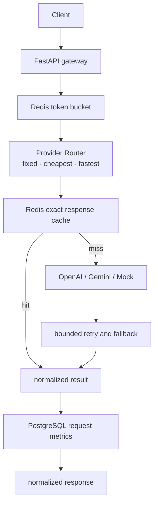

# ModelRoute

## Overview

ModelRoute is a multi-provider LLM API gateway that provides unified inference access with deterministic provider routing, Redis caching and token-bucket rate limiting, bounded retry/fallback, PostgreSQL observability, and reproducible performance benchmarking.

## Architecture



The application is a modular monolith. Redis handles low-latency cache and rate-limit state; PostgreSQL stores durable, privacy-minimized request metrics.

## Features

- Unified `POST /v1/chat/completions` API
- OpenAI, Gemini, and deterministic Mock provider adapters
- Fixed, cheapest-estimate, and fastest-recent-latency routing
- Per-attempt timeout, bounded retry, and cross-provider fallback
- Exact Redis response cache with TTL
- Atomic Redis Lua token bucket
- PostgreSQL request metrics with p50/p95 SQL aggregation
- JSON metrics API and server-rendered dashboard
- Docker Compose stack and async HTTPX benchmark runner

## Provider abstraction

Provider SDK objects and exceptions remain inside their adapters. The API returns one normalized result and token-usage shape.

- **OpenAI:** Responses API adapter for GPT-5.6 Luna, using low reasoning effort. It is covered with mocked SDK tests. A successful live inference was not run because API billing credit was intentionally not purchased.
- **Gemini:** asynchronous Interactions API adapter for Gemini 3.7 Flash, using low thinking and `max_output_tokens`. Live integration was successfully verified during Phase 2. `google-genai==2.18.1` is pinned because its async Interactions errors currently use an isolated compatibility layer.
- **Mock:** deterministic local provider used by the key-free Compose demo and benchmarks. Optional simulated latency is configuration-only and does not represent commercial provider performance.

Provider pricing is environment-configurable metadata. As of 2026-08-15, the Gemini defaults are the promotional `$0.75` input / `$3.75` output per million tokens; the documented rates become `$1.50` / `$7.50` on January 1, 2027.

## Routing

- `fixed`: configured default provider first, followed by other eligible providers.
- `cheapest`: deterministic pre-generation estimate using approximate input tokens and configured prices.
- `fastest`: process-local EWMA of successful provider latency, with a deterministic initial value.

## Reliability

- Only transient timeout, rate-limit, connection, and server failures are retried.
- Retry count and delay are bounded and configurable.
- Exhausted providers fall through to the next routed provider.
- Cache failures fail open because caching is an optimization.
- Rate-limiter failures fail closed with HTTP `503` because enforcement cannot be trusted.
- Metrics writes fail open; metrics reads return `503` when PostgreSQL is unavailable.

## Caching

Cache identities contain provider, model, prompt, and only the parameters that affect the provider request. The canonical payload is SHA-256 hashed, so prompts never appear in Redis keys. Cache hits receive a fresh request ID and current gateway latency. Their current-request model cost is `$0` because no new provider call occurs.

## Rate limiting

Redis executes the token refill, admission decision, token consumption, state write, and expiration in one Lua operation. `X-Client-ID` is used when supplied; otherwise the client address is hashed into the limiter key.

## Observability

Each completion reaching the service records one row with request ID, UTC timestamp, provider/model when successful, routing strategy, status, total gateway latency, normalized tokens, estimated cost, cache/fallback flags, and a normalized error category.

Raw prompts, generated content, API keys, and stack traces are intentionally not persisted. Estimated cost is:

```text
(input tokens * input price + output tokens * output price) / 1,000,000
```

`GET /v1/metrics/summary` calculates totals, rates, costs, and PostgreSQL `percentile_cont` p50/p95 values. `GET /v1/metrics/recent` returns a bounded privacy-safe list.

## Dashboard

`GET /dashboard` renders summary cards, provider usage, and recent requests with Jinja2 and local CSS. It has no separate frontend toolchain or external CDN.

## Technology stack

Python 3.12, FastAPI, Pydantic, OpenAI SDK, Google GenAI SDK, Redis, SQLAlchemy 2 async APIs, asyncpg, PostgreSQL 16, Jinja2, HTTPX, pytest, and Docker Compose.

## Quick start with Docker Compose

The default Compose deployment uses MockProvider and requires no commercial API keys.

```powershell
docker compose up --build -d
docker compose ps
```

Open:

- API documentation: `http://127.0.0.1:8000/docs`
- Dashboard: `http://127.0.0.1:8000/dashboard`
- Health: `http://127.0.0.1:8000/health`

Stop the stack while retaining PostgreSQL data:

```powershell
docker compose down
```

PostgreSQL uses the named `postgres_data` volume. The `modelroute` database credentials in Compose are local-development defaults only, not production security guidance. Host ports can be changed with `API_PORT`, `REDIS_PORT`, and `POSTGRES_PORT`.

## Live deployment

Public links:

- Live Demo: `https://modelroute.onrender.com/`
- API Docs: `https://modelroute.onrender.com/docs`
- Metrics Dashboard: `https://modelroute.onrender.com/dashboard`
- Health: `https://modelroute.onrender.com/health`

The public portfolio deployment runs as a Render free Docker Web Service backed by Neon PostgreSQL and Upstash Redis. It is configured with `DEFAULT_PROVIDER=mock`, which restricts public requests to MockProvider and avoids anonymous real-provider inference or uncontrolled charges.

`render.yaml` declares the safe demo configuration. Render prompts for the secret environment variables `DATABASE_URL` and `REDIS_URL`; no provider API-key variable belongs in the public deployment. `DATABASE_URL` accepts Neon `postgres://` or `postgresql://` URLs and adapts their SSL settings for SQLAlchemy/asyncpg. `REDIS_URL` must be Upstash's standard TLS Redis URL using `rediss://`, not its REST URL or token.

Render free web services may sleep after inactivity, so the first request after an idle period can have a cold start. This is a portfolio demo, not a production availability or abuse-prevention claim. Rate limiting remains demo-level protection. Do not submit confidential or personal information: PostgreSQL excludes prompts and generated content, but MockProvider echoes the prompt and its response may remain in Redis for `CACHE_TTL_SECONDS`.

## API example

```powershell
$body = @{
    prompt = "Explain binary search in one sentence"
    strategy = "fixed"
    temperature = 0.2
    max_tokens = 64
} | ConvertTo-Json

Invoke-RestMethod `
    -Method Post `
    -Uri "http://127.0.0.1:8000/v1/chat/completions" `
    -Headers @{ "X-Client-ID" = "local-demo" } `
    -ContentType "application/json" `
    -Body $body
```

The response includes `request_id`, `provider`, `model`, `content`, token counts, gateway latency, `cache_hit`, and `fallback_used`.

## Configuration

| Variable | Purpose | Compose default |
|---|---|---:|
| `DEFAULT_PROVIDER` | Fixed-route primary provider | `mock` |
| `MOCK_PROVIDER_LATENCY_MS` | Async simulated Mock upstream delay | `0` |
| `PROVIDER_TIMEOUT_SECONDS` | Per provider-attempt timeout | `20` |
| `PROVIDER_MAX_RETRIES` | Retries after the initial attempt | `1` |
| `REDIS_URL` | Redis connection | `redis://redis:6379/0` |
| `DATABASE_URL` | PostgreSQL async connection | Compose `postgres` service |
| `CACHE_TTL_SECONDS` | Exact-cache TTL | `300` |
| `RATE_LIMIT_CAPACITY` | Token bucket capacity | `20` |
| `RATE_LIMIT_REFILL_RATE` | Tokens restored per second | `1` |
| `MODELROUTE_COMPOSE_OPENAI_API_KEY` / `MODELROUTE_COMPOSE_GEMINI_API_KEY` | Optional host variables mapped to provider credentials | empty |

Compose service-to-service URLs use `redis` and `postgres`, not `localhost`. Compose-specific credential variables can be supplied explicitly at runtime; ordinary `OPENAI_API_KEY` and `GEMINI_API_KEY` values in a root `.env` are not forwarded automatically. `.env` is excluded from Git and the Docker build context.

## Testing

```powershell
python -m pip install -e ".[test]"
python -m pytest
python -m pip check
```

The final UI-polish run collected 115 tests: **114 passed and 1 PostgreSQL opt-in test skipped** because `MODELROUTE_TEST_DATABASE_URL` was not configured. Ordinary tests make no paid provider calls.

## Benchmark methodology

The benchmark used the complete Compose stack rather than an isolated function:

- MockProvider with **50 ms simulated upstream provider latency**
- One Uvicorn worker
- Redis cache and token bucket active
- Rate limit capacity/refill `10000`, making it non-binding for this measurement
- PostgreSQL metrics writes enabled for every gateway request
- 200 measured requests per scenario at concurrency `1`, `10`, `25`, and `50`
- Five unmeasured warm-up requests per case
- Unique prompts for uncached cases; one prewarmed exact prompt for cached cases
- Client-observed HTTP round-trip latency measured with async HTTPX
- Linearly interpolated p50 and p95, calculated without NumPy/Pandas

Reproduce from PowerShell:

```powershell
python -m pip install -e ".[test]"
$env:MOCK_PROVIDER_LATENCY_MS = "50"
$env:RATE_LIMIT_CAPACITY = "10000"
$env:RATE_LIMIT_REFILL_RATE = "10000"
docker compose up --build -d --force-recreate

python scripts/benchmark.py `
    --base-url http://127.0.0.1:8000 `
    --requests 200 `
    --concurrency 1,10,25,50 `
    --scenario all `
    --warmup 5 `
    --simulated-provider-latency-ms 50 `
    --output benchmarks/results/final.json
```

## Benchmark results

Measured 2026-08-15 on the local machine described below. Full-precision output is in [`benchmarks/results/final.json`](benchmarks/results/final.json).

| Scenario | Concurrency | Requests | Success | Fail | Elapsed s | RPS | Avg ms | p50 ms | p95 ms | Error rate |
|---|---:|---:|---:|---:|---:|---:|---:|---:|---:|---:|
| Uncached | 1 | 200 | 200 | 0 | 15.781 | 12.674 | 78.858 | 81.241 | 85.214 | 0.000% |
| Cached | 1 | 200 | 200 | 0 | 2.208 | 90.594 | 11.000 | 10.786 | 13.058 | 0.000% |
| Uncached | 10 | 200 | 200 | 0 | 3.673 | 54.450 | 181.111 | 163.750 | 379.205 | 0.000% |
| Cached | 10 | 200 | 200 | 0 | 1.993 | 100.327 | 98.908 | 69.276 | 209.614 | 0.000% |
| Uncached | 25 | 200 | 200 | 0 | 2.989 | 66.914 | 368.347 | 429.394 | 494.694 | 0.000% |
| Cached | 25 | 200 | 200 | 0 | 2.004 | 99.780 | 229.880 | 185.718 | 451.698 | 0.000% |
| Uncached | 50 | 200 | 200 | 0 | 2.040 | 98.017 | 472.064 | 419.377 | 808.911 | 0.000% |
| Cached | 50 | 200 | 200 | 0 | 1.218 | 164.256 | 290.870 | 228.233 | 620.051 | 0.000% |

At concurrency 1, cached p50 was **86.723% lower** than uncached p50, calculated as `1 - 10.78615 / 81.24140`. This comparison specifically includes a 50 ms simulated MockProvider delay in the uncached path and must not be generalized to OpenAI, Gemini, or other workloads.

Environment: Windows 11, 16 logical CPUs, host Python 3.12.13, Docker Desktop with its WSL2 Linux engine, Docker 29.7.2, and Docker Compose 5.3.1. These local results are not universal production guarantees; machine, Docker runtime, request mix, database load, and configuration materially affect them.

## Design decisions

- Redis owns ephemeral low-latency cache and atomic rate-limit state; PostgreSQL owns durable analytics.
- Cache failures fail open; rate-limit failures fail closed; metrics-write failures fail open.
- Prompts and generated content are deliberately excluded from PostgreSQL.
- Cache-hit cost is zero for the current request, while cached token counts remain observable.
- One Uvicorn worker keeps process-local fastest-route EWMA and benchmark semantics deterministic.

## Limitations

- Fastest-route latency history is process-local; multi-worker or horizontal deployment needs shared aggregation.
- Costs are estimates based on configured prices, which can change; unknown billing from failed attempts is omitted.
- Benchmarks use simulated MockProvider delay and local Docker Desktop, not live-provider latency.
- Authentication, streaming, and distributed multi-instance latency aggregation are not implemented.
- Successful OpenAI live inference was not verified because API credit was not purchased.
