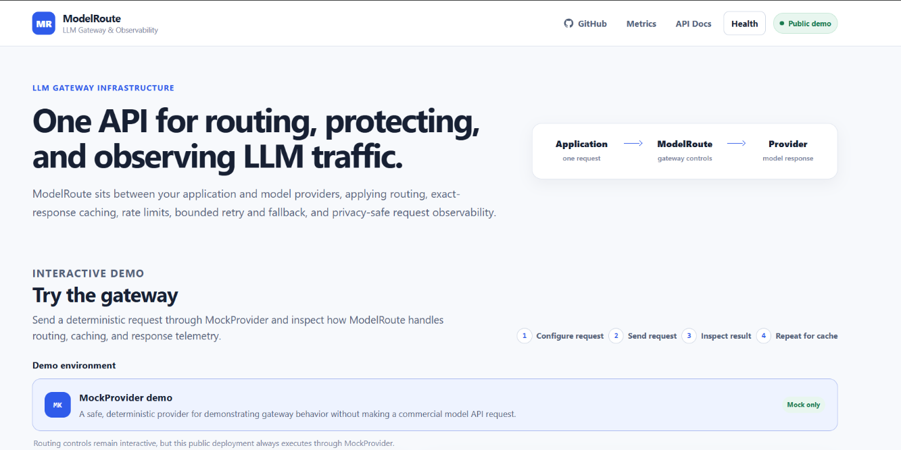
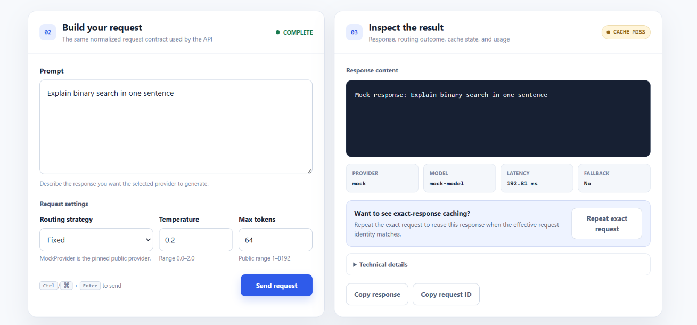
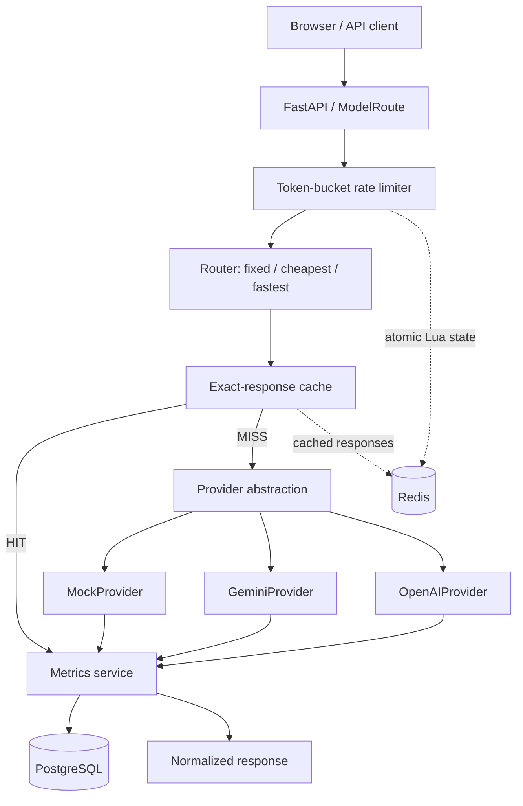

# ModelRoute

**Resilient Multi-Provider LLM API Gateway**

> A unified LLM gateway with deterministic routing, Redis caching and rate limiting, bounded retries and provider fallback, and PostgreSQL observability.

[**Live Demo**](https://modelroute.onrender.com/) · [**API Docs**](https://modelroute.onrender.com/docs) · [**Metrics Dashboard**](https://modelroute.onrender.com/dashboard)

ModelRoute is a backend and system-design project built around one provider-neutral completion API. It isolates OpenAI, Gemini, and deterministic MockProvider behavior behind adapters; routes requests using fixed, cost, or latency signals; and records privacy-safe operational telemetry.

The anonymous public deployment is deliberately **MockProvider-only**. The repository retains configurable Gemini and OpenAI adapters for local or private deployments using operator-owned credentials.

## Demo

### Public Demo Overview

The deployed console exposes the normalized request contract, routing controls, cache state, and response telemetry without making a commercial model request.



### First Request — Cache MISS

A unique effective request passes through the gateway and MockProvider, then its normalized response is cached.



### Exact Repeat — Cache HIT

Repeating the same effective request reuses the Redis response while returning a new request ID.


## Architecture



Redis owns ephemeral exact-cache and rate-limit state. PostgreSQL stores durable request telemetry without raw prompts or generated content. The deployed path is **Browser/API client → Render → Upstash Redis + Neon PostgreSQL**.

## Core engineering

### Unified gateway

`POST /v1/chat/completions` accepts a normalized request and returns provider-neutral content, provider/model identity, token usage, latency, cache state, fallback state, and a request ID. The async completion service owns routing, cache lookup, retry/fallback, and metrics recording.

### Provider abstraction

Provider-specific SDK requests, response normalization, timeouts, and exception mapping stay inside their adapters.

| Provider | Public demo | Local/private use | Verification |
|---|---|---|---|
| MockProvider | Yes | Yes | Deterministic automated and deployed verification |
| Gemini | No | With an operator key | Adapter tests plus a previous real Gemini smoke test |
| OpenAI | No | With an operator key | Adapter tests; successful live inference is not claimed because the test account had no API credits |

### Routing

| Strategy | Decision |
|---|---|
| `fixed` | Places the configured default provider first, followed by other eligible providers |
| `cheapest` | Orders eligible providers using configurable input/output pricing metadata |
| `fastest` | Orders providers using process-local EWMA latency history and deterministic initial values |

The public `DEFAULT_PROVIDER=mock` configuration restricts every strategy to MockProvider. A private deployment with Gemini or OpenAI configured routes through the same completion endpoint and provider abstraction.

## Routing, reliability, and verification

Provider execution is asynchronous, with a configurable per-attempt timeout, bounded retries, automatic cross-provider fallback, and normalized error categories.

> Real-provider smoke tests validate external adapter integration, while deterministic automated tests validate routing decisions reproducibly without depending on API cost, quota, or fluctuating network latency.

| Behavior | Verification |
|---|---|
| Fixed routing | Controlled provider availability and ordering |
| Cheapest routing | Known provider pricing metadata |
| Fastest routing | Controlled EWMA latency values |
| Retry | Provider fails, then succeeds within the configured bound |
| Fallback | First candidate fails; the next candidate succeeds |
| Timeout | Deliberately slow async provider |
| Cache | First request MISS; exact repeat HIT |
| Rate limiting | Unit tests plus a deployed concurrent burst |

The deployed limiter check used capacity `20`, refill `1 token/second`, and one client identity. A 30-request burst over approximately 5.1 seconds returned **24 HTTP 200** and **6 HTTP 429**; after waiting five seconds, all five follow-up requests succeeded, and a second client remained independent. This is functional verification, not benchmark data.

Failure semantics are deliberate:

| Failure | Gateway behavior |
|---|---|
| Provider transient failure | Bounded retry, then fallback when another provider is eligible |
| Cache Redis failure | Fail open; continue without cache |
| Rate-limit Redis failure | Fail closed with HTTP 503 |
| Telemetry write failure | Preserve the completion response |
| Telemetry read failure | Return HTTP 503 from metrics/dashboard reads |

## Redis caching and rate limiting

The response cache is intentionally exact for deterministic correctness. Its canonical SHA-256 identity includes the provider, model, prompt, and provider-specific response-affecting parameters. Raw prompt text is not exposed in the Redis key; different wording intentionally creates a different key. Cached response content remains in Redis only for the configured cache TTL.

The general rate limiter is a Redis-backed token bucket. One Lua operation uses Redis server `TIME` to refill tokens, decide admission, consume a token, persist state, and apply expiry atomically. The default capacity is `20` with a refill rate of `1 token/second`. Identity comes from a normalized `X-Client-ID` or client address and is SHA-256 hashed before use as a Redis key.

Rate limiting runs before exact-cache lookup, so cache HIT requests are still rate limited.

## Observability

PostgreSQL stores one privacy-safe telemetry row per completion reaching the service; prompts and generated content are excluded. The metrics APIs and auto-refreshing dashboard expose:

- total requests and success rate;
- cache-hit rate and fallback count;
- average, p50, and p95 gateway latency;
- normalized input/output token counts and estimated cost;
- provider/model breakdown and recent request metadata.

Endpoints: [`/v1/metrics/summary`](https://modelroute.onrender.com/v1/metrics/summary), [`/v1/metrics/recent`](https://modelroute.onrender.com/v1/metrics/recent), and [`/dashboard`](https://modelroute.onrender.com/dashboard).

## Testing and verification

```powershell
python -m pip install -e ".[test]"
python -m pytest
python -m pip check
```

The current **138-test suite** covers routing, retries and fallback, provider adapters, caching, rate limiting, metrics, API behavior, UI/dashboard rendering, and failure handling. The final verification produced **137 passed and 1 skipped**; the skipped test is the opt-in real PostgreSQL integration test enabled with `MODELROUTE_TEST_DATABASE_URL`. Automated tests make no paid provider calls.

## Benchmarks

> The benchmark used MockProvider with a **simulated 50 ms upstream-provider delay** and measures gateway/cache behavior—not commercial Gemini or OpenAI performance.

The existing artifact records 200 measured requests for each cached/uncached case at concurrency `1`, `10`, `25`, and `50`: **1,600 requests total, 0 failures, one Uvicorn worker, Redis enabled, and PostgreSQL metrics enabled**.

| Concurrency | Scenario | RPS | p50 (ms) | p95 (ms) | HTTP errors |
|---:|---|---:|---:|---:|---:|
| 1 | Uncached | 12.7 | 81.2 | 85.2 | 0% |
| 1 | Cached | 90.6 | 10.8 | 13.1 | 0% |
| 10 | Uncached | 54.4 | 163.8 | 379.2 | 0% |
| 10 | Cached | 100.3 | 69.3 | 209.6 | 0% |
| 25 | Uncached | 66.9 | 429.4 | 494.7 | 0% |
| 25 | Cached | 99.8 | 185.7 | 451.7 | 0% |
| 50 | Uncached | 98.0 | 419.4 | 808.9 | 0% |
| 50 | Cached | **164.3** | 228.2 | 620.1 | 0% |

At concurrency 1, exact caching reduced p50 from **81.2 ms to 10.8 ms—86.7% lower**. Full-precision results and environment metadata are in [`benchmarks/results/final.json`](benchmarks/results/final.json). These local Docker Desktop measurements are not universal production guarantees.

## Run locally

### Docker Compose

The shortest path uses MockProvider and requires no provider key:

```powershell
git clone https://github.com/ayushgoel001/ModelRoute.git
cd ModelRoute
docker compose up --build -d
```

Open `http://127.0.0.1:8000/`, `/docs`, or `/dashboard`. Stop while preserving the PostgreSQL volume with `docker compose down`.

### Local Python

Start reachable Redis and PostgreSQL instances, then:

```powershell
python -m venv .venv
.\.venv\Scripts\python.exe -m pip install -e ".[test]"
Copy-Item .env.example .env
# In .env, set DEFAULT_PROVIDER=mock and your local REDIS_URL/DATABASE_URL.
.\.venv\Scripts\python.exe -m uvicorn app.main:app --reload
```

Use `.env.example` as the configuration reference. Private provider selection requires only deployment-level configuration; never commit credentials:

```dotenv
# Gemini
DEFAULT_PROVIDER=gemini
GEMINI_API_KEY=<your-gemini-key>

# OpenAI
DEFAULT_PROVIDER=openai
OPENAI_API_KEY=<your-openai-key>
```

## Deployment

The public portfolio deployment runs the FastAPI Docker image on Render, with Upstash Redis and Neon PostgreSQL. It uses MockProvider only and exposes [`/health`](https://modelroute.onrender.com/health) for platform health checks. Render free-tier cold starts can delay the first request after inactivity.

## Tech stack

| Layer | Technologies |
|---|---|
| Backend | Python 3.11+, FastAPI, Pydantic, asyncio, Jinja2 |
| Providers | OpenAI SDK, Google GenAI SDK, MockProvider |
| Data | Redis, PostgreSQL, SQLAlchemy async, asyncpg |
| Infrastructure | Docker, Docker Compose, Render, Upstash, Neon |
| Frontend | Server-rendered HTML/CSS, vanilla JavaScript |
| Testing | pytest, HTTPX |
